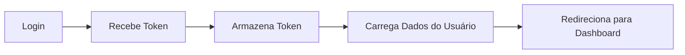
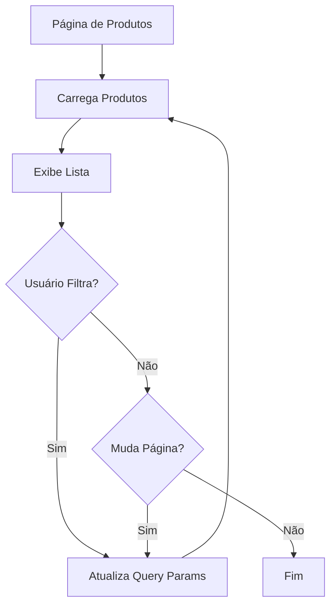
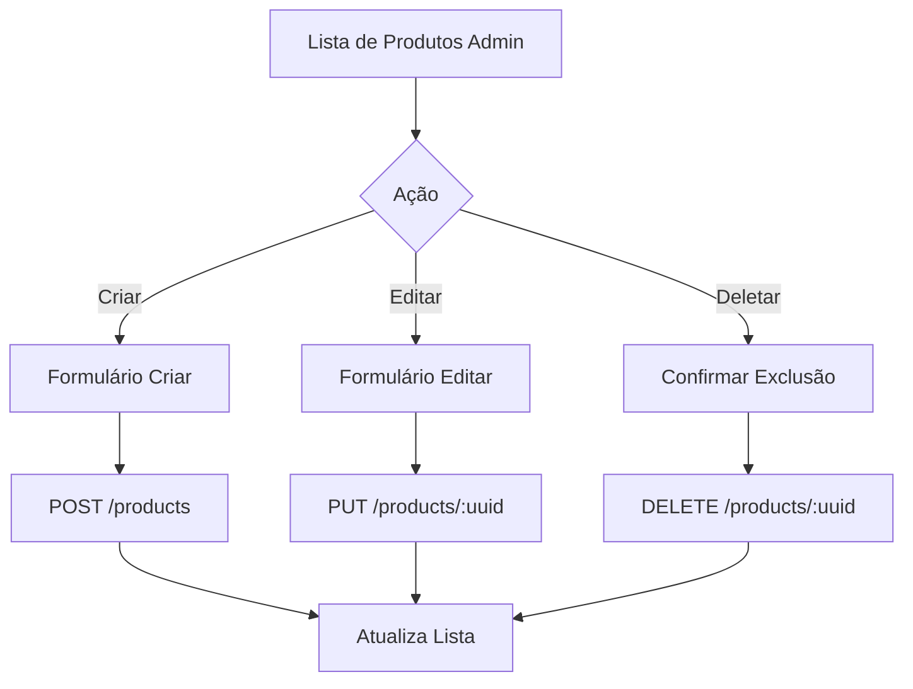

# 🎨 Guia para Desenvolvimento Front-End - E-Commerce API

Este guia foi criado para ajudar desenvolvedores front-end a integrar rapidamente com a API do E-Commerce, utilizando IAs (ChatGPT, Claude, Copilot, etc.) para acelerar o desenvolvimento.

---

## 📋 Índice

- [Como Usar Este Guia com IA](#-como-usar-este-guia-com-ia)
- [Informações Essenciais da API](#-informações-essenciais-da-api)
- [Exemplos de Prompts para IA](#-exemplos-de-prompts-para-ia)
- [Fluxos Comuns de Integração](#-fluxos-comuns-de-integração)
- [Estrutura de Dados](#-estrutura-de-dados)
- [Tratamento de Erros](#-tratamento-de-erros)
- [Boas Práticas](#-boas-práticas)

---

## 🤖 Como Usar Este Guia com IA

### Passo 1: Copie o Contexto Base

Sempre que for pedir ajuda para uma IA, inicie com este contexto:

```
Estou desenvolvendo o front-end de um e-commerce que consome uma API REST.

BASE URL: http://localhost/api/v1

A API usa autenticação JWT (Bearer Token) e retorna JSON.
Todas as respostas de erro seguem o formato: { "message": "...", "errors": {...} }
```

### Passo 2: Adicione a Documentação Específica

Copie e cole a seção relevante da [documentação da API](./README.md#-documentação-da-api) junto com sua pergunta.

### Passo 3: Seja Específico

Exemplos de bons prompts:

✅ **BOM**: "Crie um hook React para listar produtos com filtros de categoria e preço"

❌ **RUIM**: "Como faço pra pegar produtos?"

---

## 📡 Informações Essenciais da API

### URL Base

```
http://localhost/api/v1
```

### Headers Obrigatórios

Para endpoints públicos:
```javascript
{
  "Content-Type": "application/json",
  "Accept": "application/json"
}
```

Para endpoints autenticados (🔒):
```javascript
{
  "Content-Type": "application/json",
  "Accept": "application/json",
  "Authorization": "Bearer {seu_token_jwt}"
}
```

### Estrutura de Resposta Padrão

**Sucesso (200/201):**
```json
{
  "data": [...],
  "pagination": {
    "total": 100,
    "per_page": 15,
    "current_page": 1,
    "last_page": 7,
    "from": 1,
    "to": 15
  }
}
```

**Erro (4xx/5xx):**
```json
{
  "message": "Mensagem de erro legível",
  "errors": {
    "campo": ["Lista de erros do campo"]
  }
}
```

---

## 💡 Exemplos de Prompts para IA

### Para React/Next.js

#### 1. Criar Serviço de Autenticação

**Prompt:**
```
Crie um serviço de autenticação em React usando axios para esta API:

BASE_URL: http://localhost/api/v1

Endpoints:
- POST /auth/register - Registrar usuário
  Body: { name, email, password, password_confirmation }
  
- POST /auth/login - Login
  Body: { email, password }
  Response: { user: {...}, token: "...", expires_in: 3600 }

- POST /auth/logout - Logout (requer token)

- POST /auth/refresh - Renovar token (requer token)
  Response: { token: "...", expires_in: 3600 }

- GET /auth/me - Dados do usuário (requer token)

O serviço deve:
- Armazenar token no localStorage
- Adicionar token automaticamente em todas as requisições
- Redirecionar para login quando token expirar
- Ter métodos: register, login, logout, refresh, getCurrentUser
```

#### 2. Criar Hook para Produtos

**Prompt:**
```
Crie um custom hook React chamado useProducts para consumir esta API:

GET /api/v1/products com query params:
- search: string
- categories[]: array de UUIDs
- min_price: number
- max_price: number
- only_active: boolean
- only_in_stock: boolean
- sort_by: string (default: "created_at")
- sort_order: "asc" | "desc"
- per_page: number (default: 15)

Response:
{
  "data": [
    {
      "uuid": "...",
      "name": "...",
      "slug": "...",
      "price": 3500.00,
      "price_formatted": "R$ 3.500,00",
      "stock": 10,
      "is_available": true,
      "image_url": "...",
      "category": { "uuid": "...", "name": "...", "slug": "..." }
    }
  ],
  "pagination": { "total": 100, "current_page": 1, ... }
}

O hook deve:
- Suportar todos os filtros
- Ter loading state
- Ter error state
- Suportar paginação
- Fazer debounce na busca por texto
```

#### 3. Criar Formulário de Produto

**Prompt:**
```
Crie um componente React com formulário para criar/editar produtos:

Criar: POST /api/v1/products (requer token e permissão)
Editar: PUT /api/v1/products/{uuid} (requer token e permissão)

Body:
{
  "name": string (obrigatório),
  "description": string (opcional),
  "price": number (obrigatório),
  "stock": number (obrigatório),
  "category_uuid": string (obrigatório),
  "sku": string (opcional),
  "image_url": string (opcional)
}

Response: { uuid, name, slug, price, ... }

O formulário deve:
- Validar campos obrigatórios
- Formatar preço para número decimal
- Ter dropdown para selecionar categoria
- Mostrar preview da imagem se URL fornecida
- Exibir erros de validação do backend
- Redirecionar após sucesso
```

### Para Vue.js

**Prompt:**
```
Crie um composable Vue 3 (useAuth) para autenticação JWT:

[Cole as mesmas informações do exemplo React acima]

O composable deve usar:
- ref/reactive para estados
- axios para requisições
- vue-router para navegação
- Pinia store para armazenar user data
```

### Para Angular

**Prompt:**
```
Crie um AuthService Angular para JWT:

[Cole as mesmas informações do exemplo React acima]

O service deve:
- Usar HttpClient
- Implementar HttpInterceptor para adicionar token
- Usar BehaviorSubject para estado do usuário
- Ter guards para rotas protegidas
```

### Para TypeScript Types

**Prompt:**
```
Crie interfaces TypeScript para os tipos desta API:

User:
{ uuid: string, name: string, email: string, role: "ADMIN" | "MANAGER" | "CUSTOMER", created_at: string }

Product:
{ uuid: string, name: string, slug: string, description: string | null, price: number, price_formatted: string, stock: number, is_available: boolean, image_url: string | null, category: Category, created_at: string, updated_at: string }

Category:
{ uuid: string, name: string, slug: string, description: string | null, is_active: boolean, created_at: string, updated_at: string }

PaginatedResponse<T>:
{ data: T[], pagination: { total: number, per_page: number, current_page: number, last_page: number, from: number | null, to: number | null } }

ApiError:
{ message: string, errors?: Record<string, string[]> }
```

---

## 🔄 Fluxos Comuns de Integração

### Fluxo 1: Autenticação e Primeira Página



**Prompt Sugerido:**
```
Implemente o fluxo completo de login em [React/Vue/Angular]:
1. Formulário de login (email + password)
2. POST /api/v1/auth/login
3. Armazenar token e dados do usuário
4. Redirecionar para /dashboard
5. Carregar dados iniciais (produtos, categorias)
```

### Fluxo 2: Listagem com Filtros e Paginação



**Prompt Sugerido:**
```
Crie uma página de produtos completa em [React/Vue/Angular]:
- GET /api/v1/products com filtros
- Sidebar com filtros: busca, categorias, faixa de preço
- Grid de produtos responsivo
- Paginação funcional
- URL reflete filtros atuais (query params)
- Loading state durante requisições
```

### Fluxo 3: CRUD de Produto (Admin)



**Prompt Sugerido:**
```
Implemente CRUD completo de produtos para área admin:

Listar: GET /api/v1/products (com filtros admin)
Criar: POST /api/v1/products (requer manage-products)
Editar: PUT /api/v1/products/{uuid} (requer manage-products)
Deletar: DELETE /api/v1/products/{uuid} (requer manage-products)

Componentes necessários:
- Tabela de produtos com ações
- Modal/Página de criar produto
- Modal/Página de editar produto
- Dialog de confirmação de exclusão
- Validação de permissões
- Feedback de sucesso/erro
```

### Fluxo 4: Busca em Tempo Real

**Prompt Sugerido:**
```
Implemente busca de produtos em tempo real:

API: GET /api/v1/products/search?term={termo}&per_page=10

Requisitos:
- Input de busca no header
- Dropdown com resultados enquanto digita
- Debounce de 300ms
- Mostrar até 10 resultados
- Loading indicator
- "Ver todos" redireciona para página de resultados
- Limpar ao clicar fora
```

---

## 📊 Estrutura de Dados

### User (Usuário)

```typescript
interface User {
  uuid: string;
  name: string;
  email: string;
  role: "ADMIN" | "MANAGER" | "CUSTOMER";
  created_at: string; // ISO 8601
}
```

### Product (Produto)

```typescript
interface Product {
  uuid: string;
  name: string;
  slug: string;
  description: string | null;
  price: number; // Em reais (ex: 3500.00)
  price_formatted: string; // "R$ 3.500,00"
  stock: number;
  is_available: boolean;
  sku: string | null;
  image_url: string | null;
  category: Category;
  created_at: string; // ISO 8601
  updated_at: string; // ISO 8601
}
```

### Category (Categoria)

```typescript
interface Category {
  uuid: string;
  name: string;
  slug: string;
  description: string | null;
  is_active: boolean;
  created_at: string; // ISO 8601
  updated_at: string; // ISO 8601
}
```

### AuthResponse (Resposta de Login/Register)

```typescript
interface AuthResponse {
  user: User;
  token: string; // JWT Token
  expires_in: number; // Segundos até expirar (ex: 3600 = 1 hora)
}
```

### PaginatedResponse (Lista Paginada)

```typescript
interface PaginatedResponse<T> {
  data: T[];
  pagination: {
    total: number;
    per_page: number;
    current_page: number;
    last_page: number;
    from: number | null;
    to: number | null;
  };
}
```

### ApiError (Erro da API)

```typescript
interface ApiError {
  message: string;
  errors?: Record<string, string[]>; // { "email": ["Email já existe"] }
}
```

---

## ⚠️ Tratamento de Erros

### Códigos HTTP e Como Tratar

| Código | Significado | Ação no Front-End |
|--------|-------------|-------------------|
| 200 | Sucesso | Exibir dados |
| 201 | Criado | Redirecionar ou atualizar lista |
| 400 | Requisição inválida | Exibir mensagem de erro |
| 401 | Não autenticado | Redirecionar para login |
| 403 | Sem permissão | Exibir "Acesso negado" |
| 404 | Não encontrado | Exibir "Não encontrado" |
| 422 | Validação falhou | Exibir erros nos campos |
| 500 | Erro interno | Exibir "Erro no servidor" |

### Exemplo de Tratamento

**Prompt para IA:**
```
Crie um interceptor axios que trata todos os erros:

401: Limpar token e redirecionar para /login
403: Mostrar toast "Você não tem permissão"
422: Retornar erros para exibir nos campos do form
500: Mostrar toast "Erro no servidor, tente novamente"

Também deve adicionar token automaticamente em toda requisição se existir.
```

### Exibindo Erros de Validação (422)

```typescript
// Response de erro
{
  "message": "The given data was invalid",
  "errors": {
    "email": ["O email já está em uso"],
    "password": ["A senha deve ter no mínimo 8 caracteres"]
  }
}
```

**Prompt para IA:**
```
Crie um helper para exibir erros de validação da API nos campos do formulário [React Hook Form / Formik / VeeValidate]:

Estrutura do erro:
{ message: string, errors: { campo: string[] } }

O helper deve:
- Iterar sobre os erros
- Associar cada erro ao campo correspondente
- Exibir abaixo do input
- Limpar quando campo for editado
```

---

## ✅ Boas Práticas

### 1. Gerenciamento de Token

**✅ FAÇA:**
- Armazene token no `localStorage` ou `sessionStorage`
- Adicione token automaticamente em todas as requisições
- Implemente refresh token antes de expirar
- Limpe token ao fazer logout

**❌ NÃO FAÇA:**
- Armazenar token em cookies sem httpOnly
- Enviar token na URL
- Esquecer de validar expiração

### 2. Estado de Loading

**Prompt para IA:**
```
Todo componente que faz requisição deve ter:
- Estado de loading (spinner/skeleton)
- Estado de erro (mensagem amigável)
- Estado de sucesso (dados renderizados)
- Empty state (quando lista vazia)

Implemente isso em [React/Vue/Angular] para listagem de produtos.
```

### 3. Paginação

**✅ FAÇA:**
- Use query params na URL (?page=2)
- Mantenha filtros ao mudar página
- Mostre "Carregando..." ao trocar página
- Desabilite botões de paginação durante loading

### 4. Filtros e Busca

**Prompt para IA:**
```
Implemente filtros de produtos com:
- Debounce de 300ms no campo de busca
- Filtros na URL (query params)
- Botão "Limpar filtros"
- Contador de resultados
- Manter filtros ao navegar para produto e voltar

API: GET /api/v1/products?search=...&categories[]=...&min_price=...
```

### 5. Validação de Permissões

```typescript
// Exemplo de verificação
const canManageProducts = user?.role === 'ADMIN' || user?.role === 'MANAGER';

// Esconder botões
{canManageProducts && <CreateButton />}

// Proteger rotas
<Route path="/admin" element={<RequireAuth roles={['ADMIN', 'MANAGER']} />} />
```

**Prompt para IA:**
```
Crie um sistema de permissões baseado em roles:

Roles: ADMIN, MANAGER, CUSTOMER

Permissões:
- manage-products: ADMIN, MANAGER
- manage-categories: ADMIN, MANAGER
- delete-users: ADMIN

Implemente:
- Hook useAuth que retorna user e funções can()
- Componente <Can permission="..."> que esconde conteúdo
- Guard para rotas protegidas
```

### 6. Cache e Otimização

**Prompt para IA:**
```
Implemente cache de listagens usando [React Query / SWR / Pinia]:

Estratégia:
- Cache de 5 minutos para listagens
- Invalidar cache ao criar/editar/deletar
- Refetch ao focar na aba
- Background refetch a cada 30s
```

---

## 🎯 Checklist de Implementação

### Autenticação
- [ ] Página de Login
- [ ] Página de Registro
- [ ] Logout
- [ ] Refresh Token automático
- [ ] Proteção de rotas
- [ ] Redirect após login

### Produtos (Público)
- [ ] Listagem com grid responsivo
- [ ] Filtros (busca, categoria, preço)
- [ ] Paginação
- [ ] Página de detalhes
- [ ] Busca em tempo real

### Admin - Produtos
- [ ] Tabela de produtos
- [ ] Criar produto
- [ ] Editar produto
- [ ] Deletar produto (confirmação)
- [ ] Upload de imagem

### Admin - Categorias
- [ ] Listar categorias
- [ ] Criar categoria
- [ ] Editar categoria
- [ ] Deletar categoria

### UX
- [ ] Loading states
- [ ] Error handling
- [ ] Empty states
- [ ] Toasts/Notifications
- [ ] Confirmações de ações destrutivas

---

## 🚀 Templates de Projeto

### Criar Projeto React

**Prompt completo para IA:**
```
Crie a estrutura inicial de um projeto React + TypeScript + Vite para consumir esta API de e-commerce:

BASE_URL: http://localhost/api/v1

Estrutura desejada:
src/
  ├── api/              # Axios config, interceptors
  ├── components/       # Componentes reutilizáveis
  │   ├── ui/          # Botões, Inputs, Cards
  │   ├── layout/      # Header, Footer, Sidebar
  │   └── products/    # ProductCard, ProductGrid
  ├── hooks/           # useAuth, useProducts, useCategories
  ├── pages/           # Login, Products, ProductDetail, Admin
  ├── types/           # TypeScript interfaces
  ├── utils/           # Helpers, formatters
  └── routes/          # React Router config

Dependências necessárias:
- axios
- react-router-dom
- react-hook-form
- zod (validação)
- @tanstack/react-query
- tailwindcss (ou Material-UI)

Configure:
- Axios com interceptors
- React Router com rotas protegidas
- React Query para cache
- Variáveis de ambiente (.env)
```

### Criar Projeto Vue

**Prompt completo para IA:**
```
Crie a estrutura inicial Vue 3 + TypeScript + Vite para esta API:

[Mesmo contexto da API acima]

Estrutura:
src/
  ├── api/
  ├── components/
  ├── composables/    # useAuth, useProducts
  ├── views/
  ├── router/
  ├── stores/         # Pinia stores
  ├── types/
  └── utils/

Dependências:
- axios
- vue-router
- pinia
- vee-validate
- @tanstack/vue-query
```

---

## 📚 Recursos Adicionais

### Links Úteis

- [Documentação Completa da API](./README.md)
- JWT.io - Para debugar tokens
- Postman/Insomnia - Testar endpoints

### Perguntas Frequentes

**Q: Como testar sem backend rodando?**
A: Use Mock Service Worker (MSW) ou json-server

**Prompt:**
```
Configure MSW para mockar esta API:
[Cole endpoints que precisa mockar]
```

**Q: Como fazer upload de imagens?**
A: Atualmente a API aceita apenas URL. Futuramente terá endpoint de upload.

**Q: Preciso de websockets?**
A: Não. Use polling ou React Query para atualização automática.

---

## 💬 Exemplos Práticos de Prompts

### Componente Completo

```
Crie um componente React completo de Card de Produto:

Props:
- product: { uuid, name, price, price_formatted, image_url, category, is_available, stock }

O card deve:
- Mostrar imagem (fallback se null)
- Nome do produto
- Preço formatado
- Badge da categoria
- Badge "Esgotado" se stock === 0
- Botão "Ver detalhes" que navega para /products/{uuid}
- Hover effect
- Responsivo (grid 1-2-3-4 colunas)

Estilo: Tailwind CSS
```

### Hook Customizado

```
Crie um hook useCart em React:

Funcionalidades:
- Adicionar produto (armazena no localStorage)
- Remover produto
- Atualizar quantidade
- Calcular total
- Limpar carrinho
- Persistir entre sessões

Estrutura:
{
  items: [{ product: Product, quantity: number }],
  addItem: (product, quantity) => void,
  removeItem: (productUuid) => void,
  updateQuantity: (productUuid, quantity) => void,
  clear: () => void,
  total: number,
  itemCount: number
}
```

### Página Completa

```
Crie a página de checkout completa:

Etapas:
1. Revisar carrinho (produtos, quantidades, total)
2. Dados de entrega (form com validação)
3. Pagamento (integração futura)
4. Confirmação

Validações:
- CEP válido
- CPF válido
- Campos obrigatórios

Estado:
- Persistir entre etapas
- Loading ao finalizar
- Redirect após sucesso
```

---

**🎉 Pronto! Use este guia para acelerar seu desenvolvimento front-end com ajuda de IAs.**

**Dica Final:** Sempre cole o contexto completo (BASE_URL, estrutura de dados, endpoints) quando pedir ajuda para uma IA. Quanto mais contexto, melhor a resposta!
